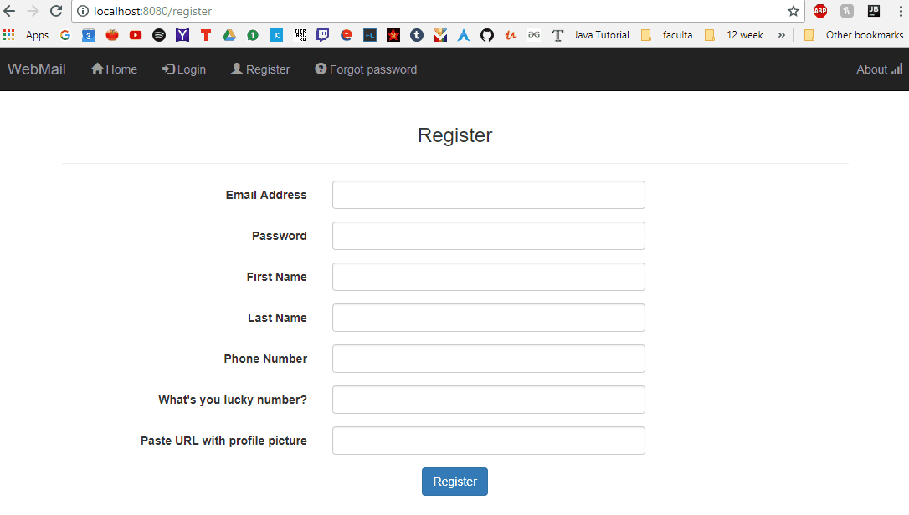
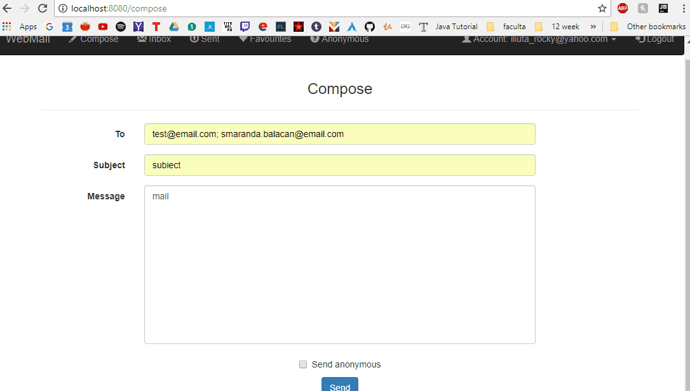

# WebMail
App made simulating a mail service made with Spring MVC, MySql database, Jpa, Jsf

On the landing page you can create and account and log in.
You can also recover your lost password by completing the forgot password form, and filling the recovery email where you whant to send the password.

After you log in, you will see 4 tabs which you can select and filter emails.
You can go to the main inbox, where you will see all the emails you received.
You can save the emails from inbox to the Marked emails.
In the anonymous tab you can receive anonymous emais from people.

